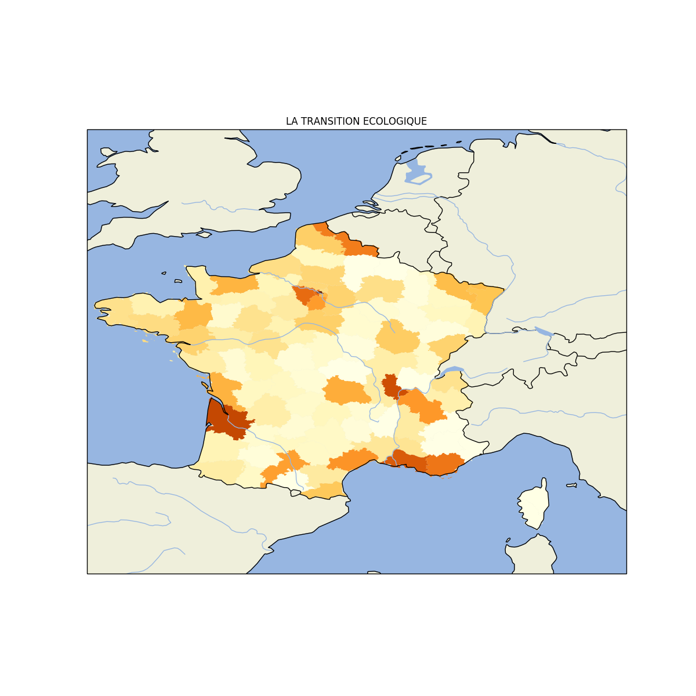
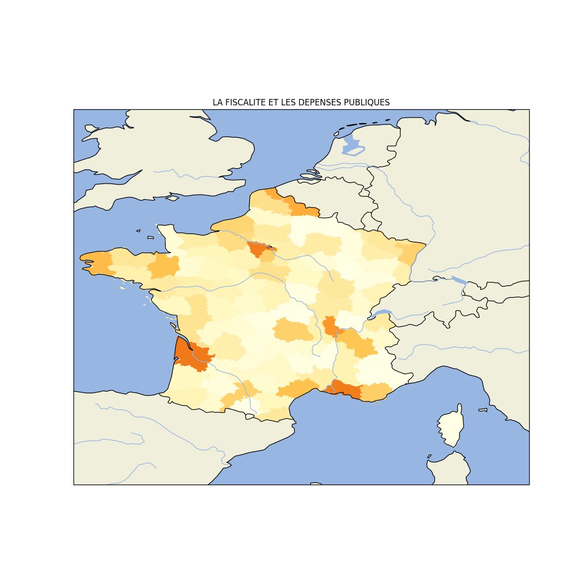
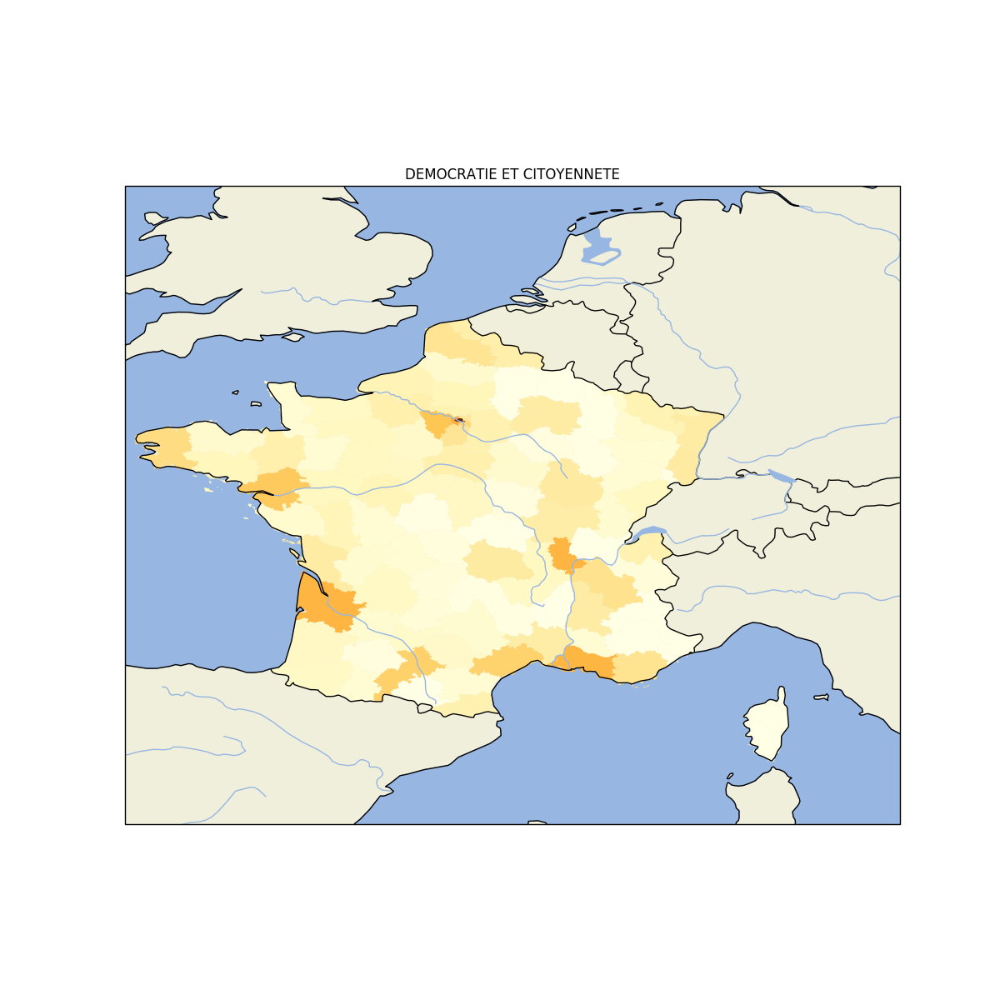

# Grand débat (Gilets jaunes) : Analyse indépendante des réponses

## Contexte

La crise sociale des "Gilets Jaunes" secoue la France depuis novembre 2018.

Pour tenter d'y répondre, le gouvernement a lancé une grande consultation publique sur des thèmes spécifiques.

## Quatre grands thèmes

- ORGANISATION DE L'ETAT ET DES SERVICES PUBLICS (30 questions)

- LA TRANSITION ECOLOGIQUE (16 questions)

- LA FISCALITE ET LES DEPENSES PUBLIQUES (8 questions)

- DEMOCRATIE ET CITOYENNETE (30 question)

## Méthode

Tous les scripts utilisés pour télécharger et analyser les données sont disponibles dans ce dossier Github.

Pour relancer les analyses vous-même, voir le fichier technical_README.md (développé pour OS basé sur Debian / Ubuntu).

Ce rapport est automatiquement écrit par le programme, veuillez excuser les erreurs de typos générées par la suppression de caractères spéciaux pour traiter les chaînes de caractères comme les apostrophes.

## Critique des fichiers

Tout d'abbord, les fichiers ne sont pas encodés en UTF8, ce qui est dommage à l'heure du normage des fichiers sur Internet par cet encodage (ils sont en ISO-8859-1).

Plus embêtant, les en-têtes de tableaux sont différents pour les fichiers de réponses d'un grand thème. Par exemple, la question suivante est trouvée sous trois formes différentes suivant la date du fichier :

- "Q169 - Que pensez-vous de l'organisation de l'Etat et des administrations en France ? De quelle manière cette organisation devrait-elle évoluer ?"
- "Que pensez-vous de l'organisation de l'Etat et des administrations en France ? De quelle manière cette organisation devrait-elle évoluer ?"
- "QUXVlc3Rpb246MTY5 - Que pensez-vous de l'organisation de l'Etat et des administrations en France ? De quelle manière cette organisation devrait-elle évoluer ?"

Celà ne facilite pas le travail de ré-analyse des données publiques. Une normalisation avant publication pourrait quand même être effectuée

## Contact

        contact (at) tadadata (dot) fr

******************
## ORGANISATION DE LETAT ET DES SERVICES PUBLICS

### Carte de participation

### 1 - Avez-vous déjà utilisé certaines de ces nouvelles formes de services publics ?

#### Statistiques générales sur les réponses

Nombre de réponses : 269796

#### Détail de la réponse fermées

Pourcentage de "oui" : 27.99%

Pourcentage de "Non" : 72.01%

### 2 - Comment l'Etat et les collectivités territoriales peuvent-ils s'améliorer pour mieux répondre aux défis de nos territoires les plus en difficulté ?

#### Statistiques générales sur les réponses

Nombre de réponses : 191064

Taille moyenne des réponses (caractères) : 182.61

Taille moyenne des réponses (mots) : 29.17

Taille maximum des réponses (mots) : 2195

#### Thèmes majoritaires dans la question ouverte :

Mots les plus importants dans les réponses :

- services
- territoires
- publics
- citoyens
- terrain
- proximité
- faire
- collectivités
- faut
- communes
- moyens
- service
- écoute
- territoire
- public
- fonctionnaires
- etat
- régions
- supprimer
- mieux

Racines de mots les plus importants dans les réponses :

- servic
- territoir
- public
- commun
- administr
- fair
- faut
- collect
- citoyen
- local
- région
- difficult
- moyen
- aid
- etat
- développ
- fonctionnair
- grand
- territorial
- terrain

### 3 - Connaissez-vous le "droit à l'erreur", c'est-à-dire le droit d'affirmer votre bonne foi lorsque vous faites un erreur dans vos déclarations ?

#### Statistiques générales sur les réponses

Nombre de réponses : 272339

#### Détail de la réponse fermées

Pourcentage de "oui" : 79.18%

Pourcentage de "Non" : 20.82%

### 4 - Estimez-vous avoir accès aux services publics dont vous avez besoin ?

#### Statistiques générales sur les réponses

Nombre de réponses : 280682

#### Détail de la réponse fermées

Pourcentage de "oui" : 68.17%

Pourcentage de "Non" : 31.83%

### 5 - Faut-il donner plus d'autonomie aux fonctionnaires de terrain ?

#### Statistiques générales sur les réponses

Nombre de réponses : 230363

#### Détail de la réponse fermées

Pourcentage de "oui" : 71.87%

Pourcentage de "Non" : 28.13%

### 6 - Faut-il revoir le fonctionnement et la formation de l'administration ?

#### Statistiques générales sur les réponses

Nombre de réponses : 231673

#### Détail de la réponse fermées

Pourcentage de "oui" : 90.41%

Pourcentage de "Non" : 9.59%

### 7 - Pouvez-vous identifier des règles que l'administration vous a déjà demandé d'appliquer et que vous avez jugées inutiles ou trop complexes ?

#### Statistiques générales sur les réponses

Nombre de réponses : 131957

Taille moyenne des réponses (caractères) : 158.48

Taille moyenne des réponses (mots) : 26.81

Taille maximum des réponses (mots) : 1996

#### Thèmes majoritaires dans la question ouverte :

Mots les plus importants dans les réponses :

- demande
- déclaration
- permis
- impôts
- carte
- règles
- construire
- documents
- faire
- dossier
- administration
- travaux
- urbanisme
- exemple
- internet
- complexe
- grise
- identité
- retraite
- démarches

Racines de mots les plus importants dans les réponses :

- demand
- administr
- déclar
- regl
- impôt
- fair
- dossi
- complex
- cart
- docu
- perm
- servic
- exempl
- pai
- faut
- fiscal
- an
- papi
- démarch
- ident

### 8 - Quand vous pensez à l'évolution des services publics au cours des dernières années, quels sont ceux qui ont évolué de manière positive ?

#### Statistiques générales sur les réponses

Nombre de réponses : 201490

Taille moyenne des réponses (caractères) : 84.09

Taille moyenne des réponses (mots) : 13.9

Taille maximum des réponses (mots) : 3613

#### Thèmes majoritaires dans la question ouverte :

Mots les plus importants dans les réponses :

- impôts
- services
- internet
- poste
- impots
- service
- ligne
- démarches
- sécurité
- sociale
- déclaration
- administration
- fiscaux
- public
- fiscale
- caf
- publics
- carte
- finances
- accès

Racines de mots les plus importants dans les réponses :

- servic
- impôt
- internet
- public
- post
- administr
- lign
- évolu
- démarch
- cart
- fiscal
- impot
- déclar
- social
- sécur
- posit
- gris
- fair
- sit
- acces

### 9 - Que pensez-vous de l'organisation de l'Etat et des administrations en France ? De quelle manière cette organisation devrait-elle évoluer ?

#### Statistiques générales sur les réponses

Nombre de réponses : 277561

Taille moyenne des réponses (caractères) : 374.71

Taille moyenne des réponses (mots) : 60.01

Taille maximum des réponses (mots) : 13113

#### Thèmes majoritaires dans la question ouverte :

Mots les plus importants dans les réponses :

- faut
- services
- communes
- simplification
- organisation
- administrations
- supprimer
- etat
- fonctionnaires
- simplifier
- régions
- administration
- nombre
- faire
- complexe
- citoyens
- strates
- réduire
- décentralisation
- départements

Racines de mots les plus importants dans les réponses :

- administr
- servic
- commun
- faut
- région
- etat
- citoyen
- fonctionnair
- franc
- fair
- organis
- départ
- supprim
- public
- fonction
- nombr
- niveau
- grand
- pouvoir
- élus

### 10 - Quelles améliorations préconiseriez-vous ?

#### Statistiques générales sur les réponses

Nombre de réponses : 100236

Taille moyenne des réponses (caractères) : 145.64

Taille moyenne des réponses (mots) : 23.99

Taille maximum des réponses (mots) : 1528

#### Thèmes majoritaires dans la question ouverte :

Mots les plus importants dans les réponses :

- services
- publics
- service
- public
- agents
- internet
- développer
- rendez
- horaires
- faut
- faire
- maisons
- démarches
- accès
- proximité
- prise
- rdv
- personnel
- polyvalents
- ouverture

Racines de mots les plus importants dans les réponses :

- servic
- public
- agent
- administr
- internet
- fair
- faut
- maison
- rend
- commun
- développ
- démarch
- polyvalent
- horair
- form
- mair
- citoyen
- pris
- regroup
- aid

### 11 - Quels nouveaux services ou quelles démarches souhaitez-vous voir développées sur Internet en priorité ?

#### Statistiques générales sur les réponses

Nombre de réponses : 153637

Taille moyenne des réponses (caractères) : 138.16

Taille moyenne des réponses (mots) : 22.73

Taille maximum des réponses (mots) : 2597

#### Thèmes majoritaires dans la question ouverte :

Mots les plus importants dans les réponses :

- internet
- démarches
- services
- accès
- vote
- déjà
- administratives
- faut
- service
- faire
- pouvoir
- ligne
- carte
- identité
- publics
- humain
- numérique
- contact
- passeport
- public

Racines de mots les plus importants dans les réponses :

- internet
- servic
- démarch
- administr
- acces
- public
- faut
- fair
- cart
- citoyen
- aid
- développ
- lign
- demand
- pouvoir
- sit
- déjà
- humain
- numer
- utilis

### 12 - Quels sont les services publics qui doivent le plus évoluer selon vous ?

#### Statistiques générales sur les réponses

Nombre de réponses : 202809

Taille moyenne des réponses (caractères) : 138.58

Taille moyenne des réponses (mots) : 22.63

Taille maximum des réponses (mots) : 3761

#### Thèmes majoritaires dans la question ouverte :

Mots les plus importants dans les réponses :

- santé
- éducation
- services
- justice
- nationale
- emploi
- transports
- poste
- caf
- education
- hôpitaux
- impôts
- sécurité
- police
- pôle
- service
- hôpital
- sociale
- pole
- public

Racines de mots les plus importants dans les réponses :

- servic
- sant
- éduc
- public
- hôpital
- emploi
- national
- justic
- social
- administr
- transport
- faut
- post
- fair
- enseign
- sécur
- polic
- impôt
- aid
- caf

### 13 - Selon vous, l'Etat doit-il aujourd'hui transférer de nouvelles missions aux collectivités territoriales ?

#### Statistiques générales sur les réponses

Nombre de réponses : 259220

#### Détail de la réponse fermées

Pourcentage de "oui" : 50.72%

Pourcentage de "Non" : 49.28%

### 14 - Si non, quels types de services publics vous manquent dans votre territoire et qu'il est nécessaire de renforcer ?

#### Statistiques générales sur les réponses

Nombre de réponses : 113055

Taille moyenne des réponses (caractères) : 170.34

Taille moyenne des réponses (mots) : 28.36

Taille maximum des réponses (mots) : 1829

#### Thèmes majoritaires dans la question ouverte :

Mots les plus importants dans les réponses :

- services
- poste
- santé
- transports
- publics
- service
- accès
- commun
- internet
- public
- transport
- impôts
- hôpitaux
- médecins
- ville
- proximité
- faut
- manque
- faire
- horaires

Racines de mots les plus importants dans les réponses :

- servic
- public
- transport
- post
- commun
- sant
- acces
- médecin
- faut
- internet
- vill
- hôpital
- fair
- administr
- habit
- rural
- manqu
- cart
- impôt
- proxim

### 15 - Si oui, avez-vous déjà utilisé ce droit à l'erreur ?

#### Statistiques générales sur les réponses

Nombre de réponses : 238369

#### Détail de la réponse fermées

Pourcentage de "oui" : 8.54%

Pourcentage de "Non" : 91.46%

### 16 - Si oui, en avez-vous été satisfait ?

#### Statistiques générales sur les réponses

Nombre de réponses : 82622

#### Détail de la réponse fermées

Pourcentage de "oui" : 68.54%

Pourcentage de "Non" : 31.46%

### 17 - Si oui, à quelle occasion en avez-vous fait usage ?

#### Statistiques générales sur les réponses

Nombre de réponses : 28057

Taille moyenne des réponses (caractères) : 106.17

Taille moyenne des réponses (mots) : 19.12

Taille maximum des réponses (mots) : 1084

#### Thèmes majoritaires dans la question ouverte :

Mots les plus importants dans les réponses :

- déclaration
- impôts
- erreur
- impôt
- revenus
- revenu
- impots
- fiscale
- droit
- paiement
- jamais
- impot
- administration
- retard
- oubli
- taxe
- bonne
- fiscal
- foi
- faire

Racines de mots les plus importants dans les réponses :

- déclar
- impôt
- erreur
- droit
- pai
- fiscal
- administr
- revenus
- impot
- revenu
- bon
- tax
- fair
- servic
- foi
- retard
- oubl
- pénal
- demand
- jam

### 18 - Si vous avez été amené à chercher un emploi, pouvez-vous indiquer les éléments de satisfaction et/ou les difficultés rencontrés en précisant, pour chaque point, l'administration concernée :

#### Statistiques générales sur les réponses

Nombre de réponses : 81254

Taille moyenne des réponses (caractères) : 169.84

Taille moyenne des réponses (mots) : 29.69

Taille maximum des réponses (mots) : 2458

#### Thèmes majoritaires dans la question ouverte :

Mots les plus importants dans les réponses :

- emploi
- concerné
- pôle
- pole
- ras
- objet
- travail
- recherche
- aide
- jamais
- formation
- trouver
- concernée
- anpe
- ans
- néant
- faire
- emplois
- chômage
- trouvé

Racines de mots les plus importants dans les réponses :

- emploi
- pôl
- pol
- trouv
- aid
- format
- recherch
- travail
- concern
- an
- propos
- fair
- entrepris
- offre
- servic
- jam
- chômag
- administr
- faut
- conseil

### 19 - Si vous avez été amené à chercher une formation, pouvez-vous indiquer les éléments de satisfaction et/ou les difficultés rencontrés en précisant, pour chaque point, l'administration concernée :

#### Statistiques générales sur les réponses

Nombre de réponses : 69664

Taille moyenne des réponses (caractères) : 150.28

Taille moyenne des réponses (mots) : 25.73

Taille maximum des réponses (mots) : 1994

#### Thèmes majoritaires dans la question ouverte :

Mots les plus importants dans les réponses :

- concerné
- formation
- emploi
- ras
- formations
- objet
- pôle
- concernée
- pole
- néant
- nc
- faire
- trouver
- financement
- jamais
- ans
- faut
- difficulté
- aide
- recherche

Racines de mots les plus importants dans les réponses :

- format
- emploi
- pôl
- concern
- financ
- trouv
- pol
- fair
- aid
- an
- professionnel
- demand
- entrepris
- organ
- faut
- propos
- administr
- difficult
- travail
- form

### 20 - Si vous avez été amené à créer une entreprise, pouvez-vous indiquer les éléments de satisfaction et/ou les difficultés rencontrés en précisant, pour chaque point, l'administration concernée :

#### Statistiques générales sur les réponses

Nombre de réponses : 55542

Taille moyenne des réponses (caractères) : 143.91

Taille moyenne des réponses (mots) : 24.41

Taille maximum des réponses (mots) : 8977

#### Thèmes majoritaires dans la question ouverte :

Mots les plus importants dans les réponses :

- concerné
- entreprise
- ras
- objet
- création
- concernée
- urssaf
- nc
- auto
- rsi
- créer
- néant
- démarches
- compliqué
- entrepreneur
- simple
- commerce
- faire
- cci
- aide

Racines de mots les plus importants dans les réponses :

- entrepris
- création
- cré
- administr
- concern
- urssaf
- aid
- pai
- servic
- entrepreneur
- démarch
- auto
- rsi
- fair
- complex
- activ
- commerc
- difficult
- faut
- impôt

### 21 - Si vous avez été amené à demander un remboursement de soins de santé, pouvez-vous indiquer les éléments de satisfaction et/ou les difficultés rencontrés en précisant, pour chaque point, l'administration concernée :

#### Statistiques générales sur les réponses

Nombre de réponses : 114287

Taille moyenne des réponses (caractères) : 142.59

Taille moyenne des réponses (mots) : 24.12

Taille maximum des réponses (mots) : 1789

#### Thèmes majoritaires dans la question ouverte :

Mots les plus importants dans les réponses :

- problème
- ras
- remboursement
- cpam
- sociale
- mutuelle
- sécurité
- remboursements
- fonctionne
- soins
- difficulté
- carte
- santé
- vitale
- satisfait
- mutuelles
- charge
- ameli
- rapide
- système

Racines de mots les plus importants dans les réponses :

- rembours
- mutuel
- social
- soin
- sécur
- cpam
- problem
- sant
- cart
- fonction
- charg
- pai
- médecin
- vital
- malad
- pris
- fair
- difficult
- demand
- rapid

### 22 - Si vous avez été amené à faire une demande d'aide pour une situation de handicap, pouvez-vous indiquer les éléments de satisfaction et/ou les difficultés rencontrés en précisant, pour chaque point, l'administration concernée :

#### Statistiques générales sur les réponses

Nombre de réponses : 54341

Taille moyenne des réponses (caractères) : 147.46

Taille moyenne des réponses (mots) : 25.49

Taille maximum des réponses (mots) : 2977

#### Thèmes majoritaires dans la question ouverte :

Mots les plus importants dans les réponses :

- concerné
- ras
- objet
- concernée
- mdph
- néant
- handicap
- nc
- dossier
- demande
- long
- réponse
- mois
- aide
- handicapé
- faire
- dossiers
- délais
- ans
- situation

Racines de mots les plus importants dans les réponses :

- handicap
- mdph
- dossi
- concern
- demand
- aid
- an
- mois
- del
- enfant
- fair
- long
- administr
- situat
- trait
- répons
- pris
- faut
- cart
- charg

### 23 - Si vous avez été amené à former du personnel, pouvez-vous indiquer les éléments de satisfaction et/ou les difficultés rencontrés en précisant, pour chaque point, l'administration concernée :

#### Statistiques générales sur les réponses

Nombre de réponses : 33768

Taille moyenne des réponses (caractères) : 90.38

Taille moyenne des réponses (mots) : 15.07

Taille maximum des réponses (mots) : 1084

#### Thèmes majoritaires dans la question ouverte :

Mots les plus importants dans les réponses :

- concerné
- ras
- objet
- formation
- nc
- concernée
- néant
- formations
- idem
- personnel
- organismes
- entreprise
- opca
- administration
- former
- applicable
- entreprises
- professionnelle
- faire
- travail

Racines de mots les plus importants dans les réponses :

- format
- concern
- entrepris
- form
- organ
- professionnel
- personnel
- emploi
- ras
- administr
- fair
- opca
- travail
- objet
- salari
- aid
- charg
- financ
- temp
- besoin

### 24 - Si vous avez été amené à mettre fin à votre activité, pouvez-vous indiquer les éléments de satisfaction et/ou les difficultés rencontrés en précisant, pour chaque point, l'administration concernée :

#### Statistiques générales sur les réponses

Nombre de réponses : 33237

Taille moyenne des réponses (caractères) : 89.1

Taille moyenne des réponses (mots) : 15.53

Taille maximum des réponses (mots) : 1084

#### Thèmes majoritaires dans la question ouverte :

Mots les plus importants dans les réponses :

- concerné
- ras
- objet
- nc
- concernée
- néant
- activité
- retraite
- problème
- entreprise
- rsi
- difficulté
- urssaf
- idem
- fin
- applicable
- voir
- ans
- difficultés
- cas

Racines de mots les plus importants dans les réponses :

- concern
- activ
- entrepris
- retrait
- administr
- an
- ras
- fin
- urssaf
- difficult
- rsi
- pai
- fair
- objet
- servic
- liquid
- problem
- societ
- emploi
- commerc

### 25 - Si vous avez été amené à préparer votre retraite, pouvez-vous indiquer les éléments de satisfaction et/ou les difficultés rencontrés en précisant, pour chaque point, l'administration concernée :

#### Statistiques générales sur les réponses

Nombre de réponses : 102440

Taille moyenne des réponses (caractères) : 148.41

Taille moyenne des réponses (mots) : 25.52

Taille maximum des réponses (mots) : 1084

#### Thèmes majoritaires dans la question ouverte :

Mots les plus importants dans les réponses :

- retraite
- problème
- concerné
- dossier
- carsat
- ras
- difficulté
- ans
- cnav
- internet
- carrière
- caisses
- site
- mois
- satisfait
- service
- services
- faire
- demande
- difficultés

Racines de mots les plus importants dans les réponses :

- retrait
- dossi
- an
- demand
- carsat
- servic
- caiss
- difficult
- mois
- carri
- problem
- cnav
- fair
- inform
- administr
- internet
- répons
- complémentair
- sit
- prépar

### 26 - Si vous avez été amené à recruter du personnel, pouvez-vous indiquer les éléments de satisfaction et/ou les difficultés rencontrés en précisant, pour chaque point, l'administration concernée :

#### Statistiques générales sur les réponses

Nombre de réponses : 45047

Taille moyenne des réponses (caractères) : 113.31

Taille moyenne des réponses (mots) : 19.25

Taille maximum des réponses (mots) : 1084

#### Thèmes majoritaires dans la question ouverte :

Mots les plus importants dans les réponses :

- concerné
- emploi
- ras
- objet
- pôle
- pole
- concernée
- nc
- néant
- travail
- personnel
- recrutement
- recruter
- charges
- aide
- urssaf
- faire
- cesu
- embauche
- candidats

Racines de mots les plus importants dans les réponses :

- emploi
- recrut
- pôl
- concern
- pol
- travail
- entrepris
- embauch
- personnel
- aid
- servic
- administr
- candidat
- fair
- salari
- difficult
- trouv
- charg
- faut
- format

### 27 - Si vous avez été amené à recruter une personne portant un handicap, pouvez-vous indiquer les éléments de satisfaction et/ou les difficultés rencontrés en précisant, pour chaque point, l'administration concernée :

#### Statistiques générales sur les réponses

Nombre de réponses : 24193

Taille moyenne des réponses (caractères) : 46.14

Taille moyenne des réponses (mots) : 8.0

Taille maximum des réponses (mots) : 1084

#### Thèmes majoritaires dans la question ouverte :

Mots les plus importants dans les réponses :

- concerné
- ras
- objet
- concernée
- nc
- néant
- applicable
- idem
- concerne
- handicap
- cas
- avis
- réponse
- neant
- travail
- so
- situation
- emploi
- nsp
- handicapé

Racines de mots les plus importants dans les réponses :

- concern
- handicap
- ras
- objet
- entrepris
- nc
- emploi
- aid
- recrut
- né
- travail
- administr
- post
- embauch
- situat
- fair
- servic
- adapt
- cas
- salari

### 28 - Si vous avez été amené à rémunérer du personnel, pouvez-vous indiquer les éléments de satisfaction et/ou les difficultés rencontrés en précisant, pour chaque point, l'administration concernée :

#### Statistiques générales sur les réponses

Nombre de réponses : 40775

Taille moyenne des réponses (caractères) : 97.02

Taille moyenne des réponses (mots) : 16.47

Taille maximum des réponses (mots) : 1084

#### Thèmes majoritaires dans la question ouverte :

Mots les plus importants dans les réponses :

- concerné
- ras
- objet
- charges
- cesu
- nc
- concernée
- néant
- urssaf
- emploi
- paie
- service
- travail
- comptable
- complexité
- idem
- sociales
- salaire
- paye
- problème

Racines de mots les plus importants dans les réponses :

- charg
- concern
- pai
- emploi
- salair
- entrepris
- cesu
- urssaf
- complex
- salari
- travail
- servic
- social
- fair
- pay
- comptabl
- fich
- ras
- rémuner
- administr

### 29 - Si vous avez été amené à scolariser votre enfant, pouvez-vous indiquer les éléments de satisfaction et/ou les difficultés rencontrés en précisant, pour chaque point, l'administration concernée :

#### Statistiques générales sur les réponses

Nombre de réponses : 87938

Taille moyenne des réponses (caractères) : 206.64

Taille moyenne des réponses (mots) : 34.89

Taille maximum des réponses (mots) : 5211

#### Thèmes majoritaires dans la question ouverte :

Mots les plus importants dans les réponses :

- concerné
- enfants
- ras
- école
- enfant
- scolaire
- difficulté
- problème
- nationale
- enseignants
- éducation
- objet
- privé
- élèves
- collège
- lycée
- écoles
- manque
- difficultés
- enseignement

Racines de mots les plus importants dans les réponses :

- enfant
- écol
- enseign
- scolair
- élev
- class
- éduc
- colleg
- national
- difficult
- priv
- lyc
- parent
- établ
- professeur
- fair
- scolaris
- faut
- niveau
- problem

### 30 - Y a-t-il d'autres points sur l'organisation de l'Etat et des services publics sur lesquels vous souhaiteriez vous exprimer ?

#### Statistiques générales sur les réponses

Nombre de réponses : 175415

Taille moyenne des réponses (caractères) : 705.0

Taille moyenne des réponses (mots) : 114.52

Taille maximum des réponses (mots) : 12890

#### Thèmes majoritaires dans la question ouverte :

Mots les plus importants dans les réponses :

- vitesse
- conducteurs
- gouvernement
- lieu
- limitation
- sécurité
- radars
- routière
- politique
- faut
- faire
- service
- km
- citoyens
- 80
- temps
- français
- mettre
- routes
- mesure

Racines de mots les plus importants dans les réponses :

- vitess
- gouvern
- conducteur
- lieu
- servic
- limit
- polit
- rout
- faut
- sécur
- franc
- fair
- routi
- radar
- citoyen
- temp
- km
- mettr
- 80
- mesur

## LA TRANSITION ECOLOGIQUE

### Carte de participation

### 1 - Avez-vous pour vos déplacements quotidiens la possibilité de recourir à des solutions de mobilité alternatives à la voiture individuelle comme les transports en commun, le covoiturage, l'auto-partage, le transport à la demande, le vélo, etc. ?

#### Statistiques générales sur les réponses

Nombre de réponses : 435996

Taille moyenne des réponses (caractères) : 15.34

Taille moyenne des réponses (mots) : 2.95

Taille maximum des réponses (mots) : 10

#### Thèmes majoritaires dans la question ouverte :

Mots les plus importants dans les réponses :

- oui
- déplacements
- quotidiens
- utilise
- voiture

Racines de mots les plus importants dans les réponses :

- oui
- déplac
- quotidien
- utilis
- voitur

### 2 - Diriez-vous que votre vie quotidienne est aujourd'hui touchée par le changement climatique ?

#### Statistiques générales sur les réponses

Nombre de réponses : 443135

#### Détail de la réponse fermées

Pourcentage de "oui" : 66.97%

Pourcentage de "Non" : 33.03%

### 3 - Et qui doit selon vous se charger de vous proposer ce type de solutions alternatives ?

#### Statistiques générales sur les réponses

Nombre de réponses : 344196

Taille moyenne des réponses (caractères) : 80.8

Taille moyenne des réponses (mots) : 13.2

Taille maximum des réponses (mots) : 868

#### Thèmes majoritaires dans la question ouverte :

Mots les plus importants dans les réponses :

- région
- collectivités
- etat
- commune
- département
- communes
- locales
- régions
- territoriales
- mairie
- entreprises
- communauté
- ville
- transports
- mairies
- départements
- commun
- collectivité
- intercommunalité
- employeur

Racines de mots les plus importants dans les réponses :

- commun
- région
- collect
- transport
- etat
- local
- départ
- entrepris
- mair
- vill
- priv
- communaut
- solut
- territorial
- public
- citoyen
- aid
- servic
- fair
- voitur

### 4 - Par rapport à votre mode de chauffage actuel, pensez-vous qu'il existe des solutions alternatives plus écologiques ?

#### Statistiques générales sur les réponses

Nombre de réponses : 420952

#### Détail de la réponse fermées

Pourcentage de "oui" : 60.15%

Pourcentage de "Non" : 39.85%

### 5 - Qu'est-ce qui pourrait vous inciter à changer vos comportements comme par exemple mieux entretenir et régler votre chauffage, modifier votre manière de conduire ou renoncer à prendre votre véhicule pour de très petites distances ?

#### Statistiques générales sur les réponses

Nombre de réponses : 384587

Taille moyenne des réponses (caractères) : 165.89

Taille moyenne des réponses (mots) : 27.77

Taille maximum des réponses (mots) : 1681

#### Thèmes majoritaires dans la question ouverte :

Mots les plus importants dans les réponses :

- déjà
- transports
- commun
- voiture
- chauffage
- faire
- transport
- véhicule
- aides
- vélo
- cyclables
- prix
- pistes
- prendre
- électrique
- faut
- changer
- aide
- isolation
- exemple

Racines de mots les plus importants dans les réponses :

- transport
- commun
- voitur
- déjà
- chauffag
- aid
- véhicul
- fair
- chang
- électr
- incit
- vill
- isol
- développ
- vélo
- faut
- utilis
- cyclabl
- petit
- pist

### 6 - Que faudrait-il faire selon vous pour apporter des réponses à ce problème ?

#### Statistiques générales sur les réponses

Nombre de réponses : 437097

Taille moyenne des réponses (caractères) : 387.78

Taille moyenne des réponses (mots) : 61.52

Taille maximum des réponses (mots) : 10470

#### Thèmes majoritaires dans la question ouverte :

Mots les plus importants dans les réponses :

- produits
- faire
- transports
- taxer
- réduire
- développer
- interdire
- faut
- limiter
- entreprises
- consommation
- agriculture
- favoriser
- pesticides
- énergies
- arrêter
- pollution
- transport
- mettre
- pays

Racines de mots les plus importants dans les réponses :

- transport
- produit
- tax
- consomm
- fair
- énerg
- développ
- faut
- écolog
- franc
- pollu
- entrepris
- utilis
- grand
- voitur
- électr
- limit
- favoris
- product
- pollut

### 7 - Que pourrait faire la France pour faire partager ses choix en matière d'environnement au niveau européen et international ?

#### Statistiques générales sur les réponses

Nombre de réponses : 361027

Taille moyenne des réponses (caractères) : 170.43

Taille moyenne des réponses (mots) : 28.09

Taille maximum des réponses (mots) : 5694

#### Thèmes majoritaires dans la question ouverte :

Mots les plus importants dans les réponses :

- exemple
- montrer
- pays
- faire
- donner
- france
- déjà
- europe
- choix
- exemplaire
- niveau
- européen
- produits
- environnement
- taxer
- écologique
- politique
- mettre
- sais
- faut

Racines de mots les plus importants dans les réponses :

- exempl
- pay
- franc
- européen
- fair
- montr
- écolog
- tax
- europ
- produit
- niveau
- don
- choix
- environ
- polit
- déjà
- faut
- développ
- international
- énerg

### 8 - Quel est aujourd'hui pour vous le problème concret le plus important dans le domaine de l'environnement ?

#### Statistiques générales sur les réponses

Nombre de réponses : 456919

Taille moyenne des réponses (caractères) : 59.14

Taille moyenne des réponses (mots) : 9.06

Taille maximum des réponses (mots) : 4087

#### Thèmes majoritaires dans la question ouverte :

Mots les plus importants dans les réponses :

- air
- pollution
- crue
- sécheresse
- dérèglements
- climatiques
- disparition
- espèces
- biodiversité
- problèmes
- eau
- climatique
- déchets
- érosion
- importants
- lié
- liés
- littoral
- important
- ensemble

Racines de mots les plus importants dans les réponses :

- climat
- déregl
- sécheress
- cru
- pollut
- air
- biodivers
- disparit
- espec
- problem
- import
- li
- eau
- sol
- déchet
- environ
- éros
- ensembl
- terr
- littoral

### 9 - Quelles seraient pour vous les solutions les plus simples et les plus supportables sur un plan financier pour vous inciter à changer vos comportements ?

#### Statistiques générales sur les réponses

Nombre de réponses : 332870

Taille moyenne des réponses (caractères) : 162.38

Taille moyenne des réponses (mots) : 26.75

Taille maximum des réponses (mots) : 8350

#### Thèmes majoritaires dans la question ouverte :

Mots les plus importants dans les réponses :

- transports
- commun
- produits
- aides
- prix
- aide
- faire
- voiture
- changer
- déjà
- voir
- transport
- isolation
- électrique
- taxes
- véhicule
- achat
- véhicules
- taxer
- faut

Racines de mots les plus importants dans les réponses :

- aid
- transport
- tax
- produit
- commun
- chang
- voitur
- fair
- véhicul
- électr
- financi
- prix
- écolog
- incit
- consomm
- comport
- faut
- solut
- isol
- impôt

### 10 - Si non, quelles sont les solutions de mobilité alternatives que vous souhaiteriez pouvoir utiliser ?

#### Statistiques générales sur les réponses

Nombre de réponses : 309509

Taille moyenne des réponses (caractères) : 51.51

Taille moyenne des réponses (mots) : 8.98

Taille maximum des réponses (mots) : 1555

#### Thèmes majoritaires dans la question ouverte :

Mots les plus importants dans les réponses :

- transports
- commun
- vélo
- covoiturage
- demande
- transport
- auto
- partage
- voiture
- marche
- électrique
- pied
- train
- véhicule
- télétravail
- campagne
- travail
- electrique
- solution
- pieds

Racines de mots les plus importants dans les réponses :

- transport
- commun
- vélo
- demand
- covoiturag
- partag
- auto
- voitur
- électr
- march
- véhicul
- pied
- solut
- train
- déplac
- vill
- utilis
- campagn
- travail
- rural

### 11 - Si oui, de quelle manière votre vie quotidienne est-elle touchée par le changement climatique ?

#### Statistiques générales sur les réponses

Nombre de réponses : 288692

Taille moyenne des réponses (caractères) : 125.45

Taille moyenne des réponses (mots) : 20.39

Taille maximum des réponses (mots) : 2080

#### Thèmes majoritaires dans la question ouverte :

Mots les plus importants dans les réponses :

- pollution
- air
- sécheresse
- saisons
- canicule
- inondations
- chaleur
- climatique
- climatiques
- températures
- eau
- disparition
- canicules
- santé
- tempêtes
- dérèglement
- climat
- oiseaux
- augmentation
- changement

Racines de mots les plus importants dans les réponses :

- pollut
- climat
- air
- sécheress
- saison
- chang
- canicul
- températur
- eau
- chaleur
- inond
- disparit
- déregl
- chaud
- augment
- oiseau
- espec
- tempêt
- insect
- vi

### 12 - Si oui, que faites-vous aujourd'hui pour protéger l'environnement et/ou que pourriez-vous faire ?

#### Statistiques générales sur les réponses

Nombre de réponses : 416575

Taille moyenne des réponses (caractères) : 192.58

Taille moyenne des réponses (mots) : 31.65

Taille maximum des réponses (mots) : 9703

#### Thèmes majoritaires dans la question ouverte :

Mots les plus importants dans les réponses :

- tri
- déchets
- consommation
- produits
- voiture
- eau
- sélectif
- transports
- bio
- commun
- chauffage
- utilisation
- vélo
- déplacements
- énergie
- consommer
- local
- faire
- limiter
- trie

Racines de mots les plus importants dans les réponses :

- tri
- consomm
- déchet
- produit
- utilis
- voitur
- eau
- local
- transport
- limit
- déplac
- achet
- bio
- commun
- achat
- électr
- chauffag
- vélo
- fair
- sélect

### 13 - Si oui, que faudrait-il faire pour vous convaincre ou vous aider à changer de mode de chauffage ?

#### Statistiques générales sur les réponses

Nombre de réponses : 271703

Taille moyenne des réponses (caractères) : 121.28

Taille moyenne des réponses (mots) : 20.19

Taille maximum des réponses (mots) : 1313

#### Thèmes majoritaires dans la question ouverte :

Mots les plus importants dans les réponses :

- chauffage
- aide
- aides
- financière
- solaire
- chaleur
- panneaux
- isolation
- chaudière
- changer
- pompe
- solaires
- déjà
- prix
- gaz
- faire
- propriétaire
- locataire
- mode
- financières

Racines de mots les plus importants dans les réponses :

- aid
- chauffag
- solair
- financi
- chang
- isol
- électr
- chaudi
- install
- énerg
- panneau
- chaleur
- mod
- fair
- pomp
- solut
- gaz
- écolog
- maison
- invest

### 14 - Si oui, que faudrait-il faire pour vous convaincre ou vous aider à utiliser ces solutions alternatives ?

#### Statistiques générales sur les réponses

Nombre de réponses : 230102

Taille moyenne des réponses (caractères) : 136.99

Taille moyenne des réponses (mots) : 23.22

Taille maximum des réponses (mots) : 1631

#### Thèmes majoritaires dans la question ouverte :

Mots les plus importants dans les réponses :

- transports
- commun
- déjà
- utilise
- transport
- vélo
- cyclables
- bus
- pistes
- voiture
- développer
- covoiturage
- horaires
- gratuité
- travail
- ville
- train
- faire
- solutions
- campagne

Racines de mots les plus importants dans les réponses :

- transport
- commun
- voitur
- utilis
- vélo
- bus
- cyclabl
- vill
- pist
- développ
- train
- déjà
- horair
- gratuit
- travail
- déplac
- solut
- covoiturag
- fair
- électr

### 15 - Y a-t-il d'autres points sur la transition écologique sur lesquels vous souhaiteriez vous exprimer ?

#### Statistiques générales sur les réponses

Nombre de réponses : 346482

Taille moyenne des réponses (caractères) : 447.76

Taille moyenne des réponses (mots) : 72.64

Taille maximum des réponses (mots) : 51212

#### Thèmes majoritaires dans la question ouverte :

Mots les plus importants dans les réponses :

- faut
- faire
- écologique
- transition
- produits
- taxer
- france
- nucléaire
- énergie
- développer
- entreprises
- arrêter
- oui
- agriculture
- environnement
- exemple
- mettre
- écologie
- déchets
- pollution

Racines de mots les plus importants dans les réponses :

- écolog
- faut
- fair
- tax
- franc
- énerg
- produit
- transit
- électr
- développ
- transport
- consomm
- voitur
- grand
- nucléair
- entrepris
- utilis
- véhicul
- product
- pollu

### 16 - À titre personnel, pensez-vous pouvoir contribuer à protéger l'environnement ?

#### Statistiques générales sur les réponses

Nombre de réponses : 443117

#### Détail de la réponse fermées

Pourcentage de "oui" : 94.51%

Pourcentage de "Non" : 5.49%

## LA FISCALITE ET LES DEPENSES PUBLIQUES

### Carte de participation

### 1 - Afin de financer les dépenses sociales, faut-il selon vous...

#### Statistiques générales sur les réponses

Nombre de réponses : 522223

Taille moyenne des réponses (caractères) : 141.44

Taille moyenne des réponses (mots) : 22.63

Taille maximum des réponses (mots) : 3525

#### Thèmes majoritaires dans la question ouverte :

Mots les plus importants dans les réponses :

- aides
- sociales
- attribution
- revoir
- conditions
- augmenter
- travail
- temps
- retraite
- âge
- reculer
- impôts
- dépenses
- fiscale
- faire
- taxer
- réduire
- supprimer
- fraude
- lutter

Racines de mots les plus importants dans les réponses :

- social
- aid
- revoir
- attribu
- condit
- augment
- travail
- retrait
- temp
- âge
- recul
- fiscal
- impôt
- tax
- dépens
- fair
- entrepris
- franc
- supprim
- fraud

### 2 - Pour quelle(s) politique(s) publique(s) ou pour quels domaines d'action publique, seriez-vous prêts à payer plus d'impôts ?

#### Statistiques générales sur les réponses

Nombre de réponses : 442531

Taille moyenne des réponses (caractères) : 100.81

Taille moyenne des réponses (mots) : 16.94

Taille maximum des réponses (mots) : 2884

#### Thèmes majoritaires dans la question ouverte :

Mots les plus importants dans les réponses :

- santé
- éducation
- impôts
- déjà
- sécurité
- education
- environnement
- payer
- transition
- justice
- écologique
- recherche
- paye
- écologie
- faut
- impôt
- paie
- dépendance
- aide
- mieux

Racines de mots les plus importants dans les réponses :

- impôt
- sant
- pai
- éduc
- déjà
- faut
- écolog
- pay
- dépens
- aid
- publiqu
- franc
- fair
- sécur
- augment
- transit
- tax
- social
- fiscal
- justic

### 3 - Que faudrait-il faire pour rendre la fiscalité plus juste et plus efficace ?

#### Statistiques générales sur les réponses

Nombre de réponses : 518709

Taille moyenne des réponses (caractères) : 355.11

Taille moyenne des réponses (mots) : 59.7

Taille maximum des réponses (mots) : 13304

#### Thèmes majoritaires dans la question ouverte :

Mots les plus importants dans les réponses :

- impôt
- revenus
- revenu
- impôts
- monde
- payer
- supprimer
- fiscales
- faire
- tranches
- fiscale
- niches
- tva
- taxer
- isf
- entreprises
- produits
- augmenter
- fiscalité
- france

Racines de mots les plus importants dans les réponses :

- impôt
- fiscal
- tax
- pai
- revenus
- revenu
- franc
- entrepris
- tranch
- supprim
- fair
- mond
- tva
- augment
- nich
- social
- aid
- citoyen
- produit
- retrait

### 4 - Quelles sont toutes les choses qui pourraient être faites pour améliorer l'information des citoyens sur l'utilisation des impôts ?

#### Statistiques générales sur les réponses

Nombre de réponses : 436728

Taille moyenne des réponses (caractères) : 216.92

Taille moyenne des réponses (mots) : 35.71

Taille maximum des réponses (mots) : 14963

#### Thèmes majoritaires dans la question ouverte :

Mots les plus importants dans les réponses :

- impôts
- dépenses
- transparence
- utilisation
- impôt
- information
- site
- citoyens
- internet
- faire
- budget
- argent
- comptes
- répartition
- année
- publiques
- etat
- informer
- recettes
- annuel

Racines de mots les plus importants dans les réponses :

- impôt
- dépens
- inform
- utilis
- citoyen
- publiqu
- transparent
- compt
- fair
- franc
- budget
- public
- fiscal
- tax
- pai
- annuel
- social
- anné
- servic
- sit

### 5 - Quels sont les domaines prioritaires où notre protection sociale doit être renforcée ?

#### Statistiques générales sur les réponses

Nombre de réponses : 439536

Taille moyenne des réponses (caractères) : 102.81

Taille moyenne des réponses (mots) : 17.0

Taille maximum des réponses (mots) : 3926

#### Thèmes majoritaires dans la question ouverte :

Mots les plus importants dans les réponses :

- santé
- dépendance
- logement
- âgées
- aide
- éducation
- handicap
- retraite
- enfance
- vieillesse
- protection
- sociale
- retraites
- handicapés
- enfants
- soins
- maladie
- aides
- sécurité
- sante

Racines de mots les plus importants dans les réponses :

- sant
- aid
- retrait
- handicap
- social
- log
- âgé
- dépend
- enfant
- protect
- malad
- soin
- éduc
- charg
- vi
- faut
- enfanc
- famill
- franc
- pris

### 6 - Quels sont selon vous les impôts qu'il faut baisser en priorité ?

#### Statistiques générales sur les réponses

Nombre de réponses : 474190

Taille moyenne des réponses (caractères) : 134.86

Taille moyenne des réponses (mots) : 23.32

Taille maximum des réponses (mots) : 6954

#### Thèmes majoritaires dans la question ouverte :

Mots les plus importants dans les réponses :

- tva
- revenu
- produits
- impôt
- impôts
- csg
- taxe
- nécessité
- habitation
- taxes
- revenus
- baisser
- supprimer
- faut
- foncière
- impots
- retraités
- impot
- travail
- charges

Racines de mots les plus importants dans les réponses :

- impôt
- tva
- tax
- produit
- revenu
- baiss
- csg
- nécess
- habit
- supprim
- faut
- revenus
- retrait
- fonci
- augment
- pai
- impot
- fiscal
- moyen
- franc

### 7 - S'il faut selon vous revoir les conditions d'attribution de certaines aides sociales, lesquelles doivent être concernées ?

#### Statistiques générales sur les réponses

Nombre de réponses : 418642

Taille moyenne des réponses (caractères) : 190.1

Taille moyenne des réponses (mots) : 31.59

Taille maximum des réponses (mots) : 11947

#### Thèmes majoritaires dans la question ouverte :

Mots les plus importants dans les réponses :

- allocations
- aides
- familiales
- rsa
- chômage
- sociales
- aide
- allocation
- enfants
- revenus
- apl
- logement
- faut
- cmu
- travail
- attribution
- revenu
- conditions
- revoir
- supprimer

Racines de mots les plus importants dans les réponses :

- aid
- alloc
- social
- familial
- enfant
- chômag
- rsa
- faut
- attribu
- franc
- travail
- log
- revenus
- contrôl
- travaill
- famill
- fair
- emploi
- condit
- supprim

### 8 - Y a-t-il d'autres points sur les impôts et les dépenses sur lesquels vous souhaiteriez vous exprimer ?

#### Statistiques générales sur les réponses

Nombre de réponses : 446559

Taille moyenne des réponses (caractères) : 471.49

Taille moyenne des réponses (mots) : 78.42

Taille maximum des réponses (mots) : 12890

#### Thèmes majoritaires dans la question ouverte :

Mots les plus importants dans les réponses :

- dépenses
- faut
- impôts
- impôt
- supprimer
- faire
- vie
- retraites
- réduire
- france
- payer
- entreprises
- fonctionnaires
- fiscale
- élus
- revenus
- retraite
- taxe
- isf
- etat

Racines de mots les plus importants dans les réponses :

- impôt
- retrait
- franc
- fiscal
- dépens
- tax
- faut
- pai
- fair
- entrepris
- social
- supprim
- aid
- salair
- publiqu
- augment
- pay
- vi
- fonction
- économ

## DEMOCRATIE ET CITOYENNETE

### Carte de participation

### 1 - Comment garantir le respect par tous de la compréhension réciproque et des valeurs intangibles de la République ?

#### Statistiques générales sur les réponses

Nombre de réponses : 242539

Taille moyenne des réponses (caractères) : 152.34

Taille moyenne des réponses (mots) : 25.58

Taille maximum des réponses (mots) : 5753

#### Thèmes majoritaires dans la question ouverte :

Mots les plus importants dans les réponses :

- éducation
- école
- civique
- valeurs
- république
- education
- loi
- respect
- faire
- instruction
- lois
- respecter
- cours
- service
- appliquer
- faut
- jeune
- primaire
- enseignement
- exemple

Racines de mots les plus importants dans les réponses :

- écol
- éduc
- respect
- valeur
- républ
- civiqu
- fair
- franc
- citoyen
- enseign
- loi
- faut
- appliqu
- droit
- jeun
- national
- sanction
- lois
- servic
- cour

### 2 - En dehors des élus politiques, faut-il donner un rôle plus important aux associations et aux organisations syndicales et professionnelles ?

#### Statistiques générales sur les réponses

Nombre de réponses : 307638

#### Détail de la réponse fermées

Pourcentage de "oui" : 60.31%

Pourcentage de "Non" : 39.69%

### 3 - En matière d'immigration, une fois nos obligations d'asile remplies, souhaitez-vous que nous puissions nous fixer des objectifs annuels définis par le Parlement ?

#### Statistiques générales sur les réponses

Nombre de réponses : 246511

Taille moyenne des réponses (caractères) : 79.05

Taille moyenne des réponses (mots) : 13.76

Taille maximum des réponses (mots) : 5753

#### Thèmes majoritaires dans la question ouverte :

Mots les plus importants dans les réponses :

- oui
- objectifs
- quotas
- immigration
- pays
- faut
- asile
- besoins
- fonction
- obligations
- france
- sais
- parlement
- objectif
- accueillir
- voir
- faire
- fixer
- accueil
- quota

Racines de mots les plus importants dans les réponses :

- oui
- immigr
- object
- pay
- franc
- quot
- asil
- accueil
- faut
- oblig
- besoin
- fix
- fonction
- integr
- fair
- économ
- migr
- parl
- polit
- annuel

### 4 - En qui faites-vous le plus confiance pour vous faire représenter dans la société et pourquoi ?

#### Statistiques générales sur les réponses

Nombre de réponses : 289691

Taille moyenne des réponses (caractères) : 145.72

Taille moyenne des réponses (mots) : 24.73

Taille maximum des réponses (mots) : 9291

#### Thèmes majoritaires dans la question ouverte :

Mots les plus importants dans les réponses :

- maire
- élus
- député
- maires
- députés
- citoyens
- confiance
- associations
- proximité
- locaux
- président
- élu
- politiques
- république
- terrain
- commune
- peuple
- politique
- syndicats
- proches

Racines de mots les plus importants dans les réponses :

- mair
- élus
- déput
- représent
- citoyen
- polit
- confianc
- local
- vot
- élu
- démocrat
- associ
- président
- part
- commun
- fair
- pouvoir
- franc
- national
- intérêt

### 5 - Faut-il faciliter le déclenchement du référendum d'initiative partagée (le RIP est organisé à l'initiative de membres du Parlement soutenu par une partie du corps électoral) qui est applicable depuis 2015 ?

#### Statistiques générales sur les réponses

Nombre de réponses : 307444

Taille moyenne des réponses (caractères) : 5.31

Taille moyenne des réponses (mots) : 1.63

Taille maximum des réponses (mots) : 4

#### Thèmes majoritaires dans la question ouverte :

Mots les plus importants dans les réponses :

- oui
- sais

Racines de mots les plus importants dans les réponses :

- oui
- sais

### 6 - Faut-il prendre en compte le vote blanc ?

#### Statistiques générales sur les réponses

Nombre de réponses : 314030

#### Détail de la réponse fermées

Pourcentage de "oui" : 82.09%

Pourcentage de "Non" : 17.91%

### 7 - Le non-cumul des mandats instauré en 2017 pour les parlementaires (députés et sénateurs) est :

#### Statistiques générales sur les réponses

Nombre de réponses : 316723

Taille moyenne des réponses (caractères) : 15.32

Taille moyenne des réponses (mots) : 3.11

Taille maximum des réponses (mots) : 4

#### Thèmes majoritaires dans la question ouverte :

Mots les plus importants dans les réponses :

- bonne
- chose
- mauvaise
- sais

Racines de mots les plus importants dans les réponses :

- chos
- bon
- mauvais
- sais

### 8 - Pensez-vous qu'il faille instaurer des contreparties aux différentes allocations de solidarité ?

#### Statistiques générales sur les réponses

Nombre de réponses : 270162

#### Détail de la réponse fermées

Pourcentage de "oui" : 73.19%

Pourcentage de "Non" : 26.81%

### 9 - Pensez-vous qu'il serait souhaitable de réduire le nombre d'élus (hors députés et sénateurs) ?

#### Statistiques générales sur les réponses

Nombre de réponses : 302108

#### Détail de la réponse fermées

Pourcentage de "oui" : 72.38%

Pourcentage de "Non" : 27.62%

### 10 - Que faudrait-il faire aujourd'hui pour mieux associer les citoyens aux grandes orientations et à la décision publique ? Comment mettre en place une démocratie plus participative ?

#### Statistiques générales sur les réponses

Nombre de réponses : 278734

Taille moyenne des réponses (caractères) : 192.94

Taille moyenne des réponses (mots) : 31.43

Taille maximum des réponses (mots) : 8083

#### Thèmes majoritaires dans la question ouverte :

Mots les plus importants dans les réponses :

- référendum
- citoyens
- ric
- référendums
- faire
- vote
- internet
- débat
- referendum
- élus
- place
- initiative
- sort
- débats
- sujets
- niveau
- décisions
- grand
- citoyenne
- mettre

Racines de mots les plus importants dans les réponses :

- citoyen
- référendum
- débat
- grand
- vot
- local
- particip
- fair
- consult
- décis
- élus
- national
- sort
- question
- polit
- démocrat
- plac
- niveau
- faut
- organis

### 11 - Que faudrait-il faire aujourd'hui pour renforcer l'engagement citoyen dans la société ?

#### Statistiques générales sur les réponses

Nombre de réponses : 235686

Taille moyenne des réponses (caractères) : 144.67

Taille moyenne des réponses (mots) : 23.88

Taille maximum des réponses (mots) : 6081

#### Thèmes majoritaires dans la question ouverte :

Mots les plus importants dans les réponses :

- service
- obligatoire
- civique
- citoyens
- vote
- citoyen
- faire
- engagement
- éducation
- militaire
- école
- donner
- associations
- élus
- société
- jeunes
- vie
- exemple
- national
- confiance

Racines de mots les plus importants dans les réponses :

- citoyen
- servic
- engag
- associ
- obligatoir
- civiqu
- fair
- vot
- don
- jeun
- écol
- societ
- polit
- particip
- respect
- éduc
- franc
- national
- vi
- faut

### 12 - Que faudrait-il faire pour consulter plus directement les citoyens sur l'utilisation de l'argent public, par l'Etat et les collectivités ?

#### Statistiques générales sur les réponses

Nombre de réponses : 255466

Taille moyenne des réponses (caractères) : 147.15

Taille moyenne des réponses (mots) : 24.08

Taille maximum des réponses (mots) : 4162

#### Thèmes majoritaires dans la question ouverte :

Mots les plus importants dans les réponses :

- référendum
- citoyens
- internet
- ric
- faire
- comptes
- transparence
- dépenses
- argent
- élus
- vote
- public
- consultation
- référendums
- utilisation
- budget
- avis
- consulter
- informer
- cour

Racines de mots les plus importants dans les réponses :

- citoyen
- consult
- compt
- dépens
- public
- référendum
- fair
- argent
- utilis
- budget
- inform
- vot
- internet
- local
- publiqu
- élus
- grand
- cour
- transparent
- niveau

### 13 - Que faudrait-il faire pour favoriser le développement de ces comportements civiques et par quels engagements concrets chacun peut-il y participer ?

#### Statistiques générales sur les réponses

Nombre de réponses : 204929

Taille moyenne des réponses (caractères) : 146.04

Taille moyenne des réponses (mots) : 24.04

Taille maximum des réponses (mots) : 5753

#### Thèmes majoritaires dans la question ouverte :

Mots les plus importants dans les réponses :

- éducation
- école
- civique
- service
- education
- exemple
- faire
- parents
- associations
- respect
- voir
- comportements
- obligatoire
- enfants
- citoyens
- faut
- vie
- sais
- donner
- jeunes

Racines de mots les plus importants dans les réponses :

- écol
- éduc
- civiqu
- citoyen
- servic
- fair
- associ
- comport
- respect
- exempl
- jeun
- parent
- enfant
- faut
- don
- engag
- sanction
- aid
- vi
- enseign

### 14 - Que faudrait-il faire pour lutter contre ces discriminations et construire une société plus solidaire et plus tolérante ?

#### Statistiques générales sur les réponses

Nombre de réponses : 197670

Taille moyenne des réponses (caractères) : 135.52

Taille moyenne des réponses (mots) : 22.47

Taille maximum des réponses (mots) : 5753

#### Thèmes majoritaires dans la question ouverte :

Mots les plus importants dans les réponses :

- éducation
- education
- éduquer
- école
- faire
- eduquer
- respect
- société
- tolérance
- sanctionner
- faut
- loi
- enfants
- lois
- appliquer
- exemple
- voir
- apprendre
- travail
- respecter

Racines de mots les plus importants dans les réponses :

- éduc
- fair
- écol
- discrimin
- respect
- social
- toler
- societ
- faut
- franc
- sanction
- jeun
- éduqu
- enfant
- citoyen
- femm
- exempl
- égal
- educ
- arrêt

### 15 - Que faudrait-il faire pour mieux représenter les différentes sensibilités politiques ?

#### Statistiques générales sur les réponses

Nombre de réponses : 260642

Taille moyenne des réponses (caractères) : 128.94

Taille moyenne des réponses (mots) : 20.58

Taille maximum des réponses (mots) : 2544

#### Thèmes majoritaires dans la question ouverte :

Mots les plus importants dans les réponses :

- proportionnelle
- dose
- élections
- instaurer
- vote
- introduire
- intégrale
- proportionnel
- législatives
- assemblée
- part
- politiques
- proportionnalité
- mettre
- partis
- nationale
- politique
- sensibilités
- citoyens
- élus

Racines de mots les plus importants dans les réponses :

- proportionnel
- part
- polit
- dos
- représent
- élect
- vot
- assembl
- citoyen
- sensibil
- national
- déput
- élus
- major
- instaur
- législ
- faut
- introduir
- scrutin
- fair

### 16 - Que faudrait-il faire pour renouer le lien entre les citoyens et les élus qui les représentent ?

#### Statistiques générales sur les réponses

Nombre de réponses : 290274

Taille moyenne des réponses (caractères) : 242.11

Taille moyenne des réponses (mots) : 40.08

Taille maximum des réponses (mots) : 6986

#### Thèmes majoritaires dans la question ouverte :

Mots les plus importants dans les réponses :

- élus
- citoyens
- faire
- transparence
- politique
- élu
- mandat
- vie
- vote
- députés
- mandats
- faut
- compte
- écoute
- pouvoir
- réunions
- débats
- terrain
- confiance
- décisions

Racines de mots les plus importants dans les réponses :

- élus
- citoyen
- polit
- mandat
- vot
- fair
- représent
- déput
- élu
- faut
- part
- vi
- compt
- local
- pouvoir
- assembl
- élect
- franc
- commun
- national

### 17 - Que faudrait-il faire pour valoriser l'engagement citoyen dans les parcours de vie, dans les relations avec l'administration et les pouvoirs publics ?

#### Statistiques générales sur les réponses

Nombre de réponses : 167474

Taille moyenne des réponses (caractères) : 125.41

Taille moyenne des réponses (mots) : 20.5

Taille maximum des réponses (mots) : 5753

#### Thèmes majoritaires dans la question ouverte :

Mots les plus importants dans les réponses :

- sais
- citoyen
- citoyens
- administration
- engagement
- service
- faire
- publics
- question
- valoriser
- civique
- voir
- vie
- pouvoirs
- idem
- services
- donner
- retraite
- éducation
- administrations

Racines de mots les plus importants dans les réponses :

- citoyen
- administr
- engag
- servic
- public
- fair
- valoris
- pouvoir
- associ
- vi
- don
- retrait
- faut
- respect
- exempl
- civiqu
- temp
- aid
- question
- publiqu

### 18 - Que pensez-vous de la participation des citoyens aux élections et comment les inciter à y participer davantage ?

#### Statistiques générales sur les réponses

Nombre de réponses : 284508

Taille moyenne des réponses (caractères) : 168.51

Taille moyenne des réponses (mots) : 28.26

Taille maximum des réponses (mots) : 2313

#### Thèmes majoritaires dans la question ouverte :

Mots les plus importants dans les réponses :

- vote
- obligatoire
- blanc
- citoyens
- compte
- participation
- voter
- faut
- élections
- élus
- faible
- prendre
- votes
- politique
- faire
- confiance
- politiques
- amende
- droit
- blancs

Racines de mots les plus importants dans les réponses :

- vot
- obligatoir
- citoyen
- particip
- blanc
- polit
- élect
- faut
- élus
- compt
- fair
- représent
- faibl
- candidat
- part
- droit
- franc
- confianc
- démocrat
- pris

### 19 - Que pensez-vous de la situation de l'immigration en France aujourd'hui et de la politique migratoire ? Quelles sont, selon vous, les critères à mettre en place pour définir la politique migratoire ?

#### Statistiques générales sur les réponses

Nombre de réponses : 259397

Taille moyenne des réponses (caractères) : 240.27

Taille moyenne des réponses (mots) : 40.46

Taille maximum des réponses (mots) : 5753

#### Thèmes majoritaires dans la question ouverte :

Mots les plus importants dans les réponses :

- immigration
- pays
- france
- faut
- politique
- accueillir
- migrants
- quotas
- accueil
- asile
- migratoire
- immigrés
- français
- faire
- intégration
- situation
- besoins
- choisie
- droit
- monde

Racines de mots les plus importants dans les réponses :

- immigr
- franc
- pay
- accueil
- polit
- faut
- migr
- integr
- migratoir
- aid
- économ
- droit
- fair
- asil
- besoin
- situat
- quot
- criter
- problem
- accept

### 20 - Que peuvent et doivent faire les pouvoirs publics pour répondre aux incivilités ?

#### Statistiques générales sur les réponses

Nombre de réponses : 241040

Taille moyenne des réponses (caractères) : 115.79

Taille moyenne des réponses (mots) : 18.84

Taille maximum des réponses (mots) : 5753

#### Thèmes majoritaires dans la question ouverte :

Mots les plus importants dans les réponses :

- sanctionner
- faire
- appliquer
- loi
- éducation
- sanctions
- amendes
- punir
- lois
- éduquer
- travaux
- justice
- incivilités
- répression
- police
- intérêt
- exemple
- fermeté
- respecter
- général

Racines de mots les plus importants dans les réponses :

- sanction
- fair
- incivil
- appliqu
- éduc
- amend
- loi
- respect
- polic
- intérêt
- traval
- général
- justic
- faut
- pein
- exempl
- lois
- écol
- mettr
- pun

### 21 - Que proposez-vous afin de répondre à ce défi qui va durer ?

#### Statistiques générales sur les réponses

Nombre de réponses : 235735

Taille moyenne des réponses (caractères) : 174.72

Taille moyenne des réponses (mots) : 29.07

Taille maximum des réponses (mots) : 5753

#### Thèmes majoritaires dans la question ouverte :

Mots les plus importants dans les réponses :

- pays
- aider
- immigration
- migrants
- faut
- politique
- voir
- faire
- développement
- france
- origine
- frontières
- aide
- intégration
- accueil
- accueillir
- quotas
- place
- français
- européenne

Racines de mots les plus importants dans les réponses :

- pay
- aid
- immigr
- franc
- accueil
- développ
- migr
- polit
- faut
- integr
- fair
- européen
- économ
- origin
- fronti
- popul
- droit
- plac
- europ
- mettr

### 22 - Que proposez-vous pour renforcer les principes de la laïcité dans le rapport entre l'Etat et les religions de notre pays ?

#### Statistiques générales sur les réponses

Nombre de réponses : 250414

Taille moyenne des réponses (caractères) : 193.2

Taille moyenne des réponses (mots) : 32.59

Taille maximum des réponses (mots) : 5753

#### Thèmes majoritaires dans la question ouverte :

Mots les plus importants dans les réponses :

- loi
- religions
- religion
- laïcité
- 1905
- appliquer
- faire
- religieux
- lois
- respecter
- respect
- france
- etat
- interdire
- faut
- école
- pays
- principes
- lieux
- république

Racines de mots les plus importants dans les réponses :

- relig
- religion
- religi
- laïcit
- loi
- respect
- franc
- appliqu
- fair
- écol
- princip
- 1905
- public
- cult
- sign
- faut
- pay
- etat
- lois
- républ

### 23 - Quel pourrait être le rôle de chacun pour faire reculer les incivilités dans la société ?

#### Statistiques générales sur les réponses

Nombre de réponses : 196499

Taille moyenne des réponses (caractères) : 93.5

Taille moyenne des réponses (mots) : 15.94

Taille maximum des réponses (mots) : 5753

#### Thèmes majoritaires dans la question ouverte :

Mots les plus importants dans les réponses :

- exemple
- éducation
- faire
- enfants
- respect
- respecter
- montrer
- éduquer
- dénoncer
- incivilités
- donner
- parents
- rôle
- intervenir
- incivilité
- exemplaire
- sais
- education
- exemplarité
- citoyen

Racines de mots les plus importants dans les réponses :

- fair
- incivil
- respect
- exempl
- enfant
- éduc
- citoyen
- parent
- comport
- rôl
- éduqu
- montr
- dénonc
- don
- interven
- respons
- faut
- pouvoir
- polic
- écol

### 24 - Quel rôle nos assemblées, dont le Sénat et le Conseil économique, social et environnemental, doivent-elles jouer pour représenter nos territoires et la société civile ?

#### Statistiques générales sur les réponses

Nombre de réponses : 214323

Taille moyenne des réponses (caractères) : 148.27

Taille moyenne des réponses (mots) : 24.85

Taille maximum des réponses (mots) : 1717

#### Thèmes majoritaires dans la question ouverte :

Mots les plus importants dans les réponses :

- rôle
- sénat
- sais
- cese
- citoyens
- supprimer
- conseil
- économique
- assemblée
- assemblées
- territoires
- élus
- faut
- social
- pouvoir
- faire
- sert
- avis
- représenter
- déjà

Racines de mots les plus importants dans les réponses :

- sénat
- rôl
- assembl
- citoyen
- représent
- ces
- conseil
- supprim
- économ
- territoir
- social
- élus
- pouvoir
- fair
- faut
- national
- lois
- polit
- societ
- compt

### 25 - Quelles sont les discriminations les plus répandues dont vous êtes témoin ou victime ?

#### Statistiques générales sur les réponses

Nombre de réponses : 199373

Taille moyenne des réponses (caractères) : 94.29

Taille moyenne des réponses (mots) : 15.51

Taille maximum des réponses (mots) : 1832

#### Thèmes majoritaires dans la question ouverte :

Mots les plus importants dans les réponses :

- racisme
- sexisme
- discrimination
- homophobie
- femmes
- discriminations
- anti
- respect
- raciales
- femme
- témoin
- vis
- homme
- blanc
- couleur
- handicap
- antisémitisme
- français
- insultes
- raciale

Racines de mots les plus importants dans les réponses :

- discrimin
- racism
- femm
- homophob
- sexism
- social
- franc
- homm
- handicap
- anti
- respect
- racial
- blanc
- vis
- origin
- témoin
- travail
- couleur
- jeun
- victim

### 26 - Quelles sont les incivilités les plus pénibles dans la vie quotidienne et que faudrait-il faire pour lutter contre ces incivilités ?

#### Statistiques générales sur les réponses

Nombre de réponses : 243582

Taille moyenne des réponses (caractères) : 163.43

Taille moyenne des réponses (mots) : 26.75

Taille maximum des réponses (mots) : 5753

#### Thèmes majoritaires dans la question ouverte :

Mots les plus importants dans les réponses :

- respect
- manque
- incivilités
- insultes
- biens
- publics
- violence
- éducation
- dégradations
- déchets
- route
- faire
- racisme
- rue
- agressions
- faut
- public
- bruit
- transports
- dégradation

Racines de mots les plus importants dans les réponses :

- respect
- incivil
- public
- manqu
- dégrad
- agress
- violenc
- fair
- ru
- insult
- sanction
- rout
- éduc
- faut
- déchet
- comport
- vol
- jet
- publiqu
- bien

### 27 - Quelles sont, selon vous, les modalités d'intégration les plus efficaces et les plus justes à mettre en place aujourd'hui dans la société ?

#### Statistiques générales sur les réponses

Nombre de réponses : 237491

Taille moyenne des réponses (caractères) : 151.67

Taille moyenne des réponses (mots) : 25.1

Taille maximum des réponses (mots) : 5753

#### Thèmes majoritaires dans la question ouverte :

Mots les plus importants dans les réponses :

- travail
- langue
- français
- apprentissage
- éducation
- intégration
- française
- apprendre
- formation
- école
- pays
- valeurs
- france
- respect
- culture
- emploi
- république
- logement
- faire
- intégrer

Racines de mots les plus importants dans les réponses :

- franc
- integr
- langu
- travail
- français
- pay
- apprentissag
- immigr
- respect
- format
- apprendr
- accueil
- éduc
- valeur
- faut
- aid
- fair
- écol
- migr
- droit

### 28 - Quels sont les comportements civiques qu'il faut promouvoir dans notre vie quotidienne ou collective ?

#### Statistiques générales sur les réponses

Nombre de réponses : 236399

Taille moyenne des réponses (caractères) : 110.42

Taille moyenne des réponses (mots) : 18.33

Taille maximum des réponses (mots) : 5753

#### Thèmes majoritaires dans la question ouverte :

Mots les plus importants dans les réponses :

- respect
- solidarité
- politesse
- tolérance
- entraide
- environnement
- engagement
- biens
- lois
- aide
- bénévolat
- fraternité
- vie
- écoute
- respecter
- vote
- bienveillance
- vivre
- institutions
- règles

Racines de mots les plus importants dans les réponses :

- respect
- politess
- solidar
- comport
- citoyen
- toler
- aid
- associ
- entraid
- vi
- fair
- public
- engag
- environ
- civiqu
- faut
- collect
- commun
- regl
- écol

### 29 - Si oui, à quel type d'associations ou d'organisations ? Et avec quel rôle ?

#### Statistiques générales sur les réponses

Nombre de réponses : 184380

Taille moyenne des réponses (caractères) : 170.56

Taille moyenne des réponses (mots) : 26.31

Taille maximum des réponses (mots) : 1805

#### Thèmes majoritaires dans la question ouverte :

Mots les plus importants dans les réponses :

- associations
- syndicats
- organisations
- syndicales
- rôle
- citoyens
- association
- ong
- professionnelles
- consommateurs
- défense
- syndicat
- consultatif
- pouvoir
- faut
- faire
- terrain
- salariés
- organisation
- élus

Racines de mots les plus importants dans les réponses :

- associ
- syndicat
- organis
- citoyen
- rôl
- représent
- syndical
- social
- professionnel
- polit
- consult
- pouvoir
- faut
- fair
- intérêt
- entrepris
- salari
- local
- proposit
- don

### 30 - Y a-t-il d'autres points sur la démocratie et la citoyenneté sur lesquels vous souhaiteriez vous exprimer ?

#### Statistiques générales sur les réponses

Nombre de réponses : 182753

Taille moyenne des réponses (caractères) : 474.7

Taille moyenne des réponses (mots) : 78.75

Taille maximum des réponses (mots) : 55831

#### Thèmes majoritaires dans la question ouverte :

Mots les plus importants dans les réponses :

- démocratie
- faut
- faire
- france
- citoyens
- français
- pays
- élus
- droit
- vote
- vie
- pouvoir
- république
- ans
- politique
- oui
- ric
- citoyen
- place
- peuple

Racines de mots les plus importants dans les réponses :

- franc
- citoyen
- démocrat
- faut
- fair
- polit
- pay
- droit
- vot
- national
- pouvoir
- élus
- grand
- part
- vi
- social
- an
- respect
- président
- représent

| MOT | SCORE TFIDF | LINK TO GRAPH
|--|--|--|
|coucou|0.456|HREF|
|merde|0.5556|HREF|
|haha|0.45456|HREFggg|
