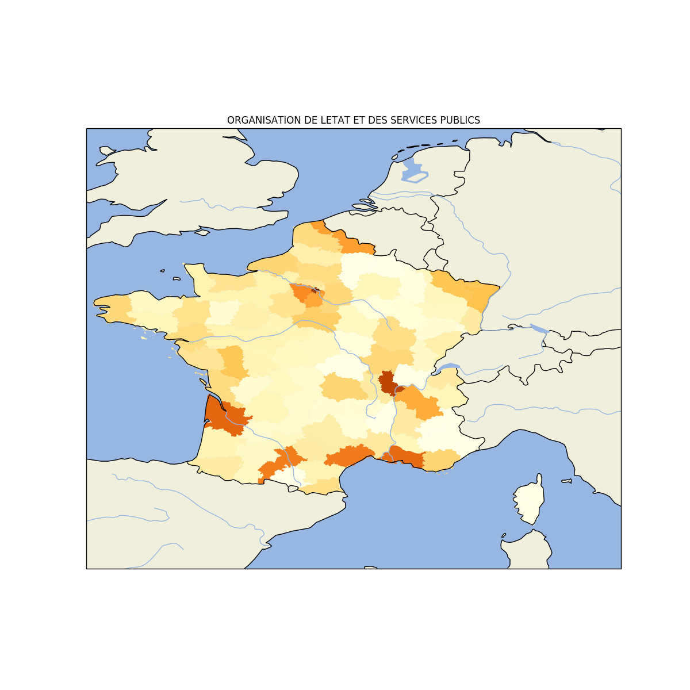

# Grand débat (Gilets jaunes) : Analyse indépendante des réponses

## Contexte

La crise sociale des "Gilets Jaunes" secoue la France depuis novembre 2018.

Pour tenter d'y répondre, le gouvernement a lancé une grande consultation publique sur des thèmes spécifiques.

## Quatre grands thèmes

- ORGANISATION DE L'ETAT ET DES SERVICES PUBLICS (30 questions)

- LA TRANSITION ECOLOGIQUE (16 questions)

- LA FISCALITE ET LES DEPENSES PUBLIQUES (8 questions)

- DEMOCRATIE ET CITOYENNETE (30 question)

## Méthode

Tous les scripts utilisés pour télécharger et analyser les données sont disponibles dans ce dossier Github.

Pour relancer les analyses vous-même, voir le fichier technical_README.md (développé pour OS basé sur Debian / Ubuntu).

Ce rapport est automatiquement écrit par le programme, veuillez excuser les erreurs de typos générées par la suppression de caractères spéciaux pour traiter les chaînes de caractères comme les apostrophes.

## Critique des fichiers

Tout d'abbord, les fichiers ne sont pas encodés en UTF8, ce qui est dommage à l'heure du normage des fichiers sur Internet par cet encodage (ils sont en ISO-8859-1).

Plus embêtant, les en-têtes de tableaux sont différents pour les fichiers de réponses d'un grand thème. Par exemple, la question suivante est trouvée sous trois formes différentes suivant la date du fichier :

- "Q169 - Que pensez-vous de l'organisation de l'Etat et des administrations en France ? De quelle manière cette organisation devrait-elle évoluer ?"
- "Que pensez-vous de l'organisation de l'Etat et des administrations en France ? De quelle manière cette organisation devrait-elle évoluer ?"
- "QUXVlc3Rpb246MTY5 - Que pensez-vous de l'organisation de l'Etat et des administrations en France ? De quelle manière cette organisation devrait-elle évoluer ?"

Celà ne facilite pas le travail de ré-analyse des données publiques. Une normalisation avant publication pourrait quand même être effectuée

## Contact

        contact (at) tadadata (dot) fr

## ORGANISATION DE LETAT ET DES SERVICES PUBLICS

### Carte de participation

### 1 - Avez-vous déjà utilisé certaines de ces nouvelles formes de services publics ?
#### Statistiques générales sur les réponses

Nombre de réponses : 269796

#### Détail de la réponse fermées

Pourcentage de "oui" : 27.99%

Pourcentage de "Non" : 72.01%

### 2 - Comment l'Etat et les collectivités territoriales peuvent-ils s'améliorer pour mieux répondre aux défis de nos territoires les plus en difficulté ?

#### Statistiques générales sur les réponses

Nombre de réponses : 191064

Taille moyenne des réponses (caractères) : 182.61

Taille moyenne des réponses (mots) : 29.17

Taille maximum des réponses (mots) : 2195

#### Thèmes majoritaires dans la question ouverte :

Racines de mots les plus importants dans les réponses :

- servic
- territoir
- public
- commun
- administr
- fair
- faut
- collect
- citoyen
- local
- région
- difficult
- moyen
- aid
- etat
- développ
- fonctionnair
- grand
- territorial
- terrain

### 3 - Connaissez-vous le "droit à l'erreur", c'est-à-dire le droit d'affirmer votre bonne foi lorsque vous faites un erreur dans vos déclarations ?

#### Statistiques générales sur les réponses

Nombre de réponses : 272339

#### Détail de la réponse fermées

Pourcentage de "oui" : 79.18%

Pourcentage de "Non" : 20.82%

### 4 - Estimez-vous avoir accès aux services publics dont vous avez besoin ?

#### Statistiques générales sur les réponses

Nombre de réponses : 280682

#### Détail de la réponse fermées

Pourcentage de "oui" : 68.17%

Pourcentage de "Non" : 31.83%

### 5 - Faut-il donner plus d'autonomie aux fonctionnaires de terrain ?

#### Statistiques générales sur les réponses

Nombre de réponses : 230363

#### Détail de la réponse fermées

Pourcentage de "oui" : 71.87%

Pourcentage de "Non" : 28.13%

### 6 - Faut-il revoir le fonctionnement et la formation de l'administration ?

#### Statistiques générales sur les réponses

Nombre de réponses : 231673

#### Détail de la réponse fermées

Pourcentage de "oui" : 90.41%

Pourcentage de "Non" : 9.59%

### 7 - Pouvez-vous identifier des règles que l'administration vous a déjà demandé d'appliquer et que vous avez jugées inutiles ou trop complexes ?

#### Statistiques générales sur les réponses

Nombre de réponses : 131957

Taille moyenne des réponses (caractères) : 158.48

Taille moyenne des réponses (mots) : 26.81

Taille maximum des réponses (mots) : 1996

#### Thèmes majoritaires dans la question ouverte :

Racines de mots les plus importants dans les réponses :

- demand
- administr
- déclar
- regl
- impôt
- fair
- dossi
- complex
- cart
- docu
- perm
- servic
- exempl
- pai
- faut
- fiscal
- an
- papi
- démarch
- ident

### 8 - Quand vous pensez à l'évolution des services publics au cours des dernières années, quels sont ceux qui ont évolué de manière positive ?

